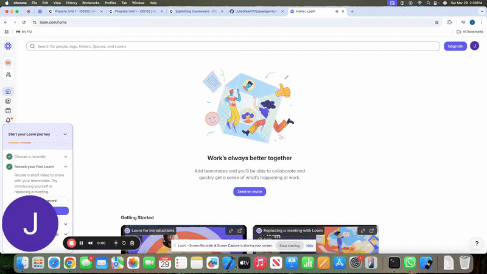

# Project 1 - *ScavengerHunt*

Submitted by: *Julio Varela**

**ScavengerHunt ** is an app that ... allows users to attach photos to see visuals and complete tasks.

Time spent: **4** hours spent in total (Majority spent on linking to github properly)

## Required Features

The following **required** functionality is completed:

- [ ] App displays list of hard-coded tasks
- [ ] When a task is tapped it navigates the user to a task detail view
- [ ] When user adds photo to complete the tasks, it marks the task as complete
- [ ] When adding photo of task, the location is added
- [ ] User returns to home page (list of tasks) and the status of your task is updated to complete
 
The following **optional** features are implemented:

- [] User can launch camera to snap a picture	

The following **additional** features are implemented:

- N/A

## Video Walkthrough

## Notes
THe main challenge I had was figureing out Github when it came to navigfating pushes and pull.
- Side challenges include navigating the Circle.inset.filled warnings while also linking in the View Controller and linking the buttons accordingly.

## License

    Copyright [2025] [Julio Varela]

    Licensed under the Apache License, Version 2.0 (the "License");
    you may not use this file except in compliance with the License.
    You may obtain a copy of the License at

        http://www.apache.org/licenses/LICENSE-2.0

    Unless required by applicable law or agreed to in writing, software
    distributed under the License is distributed on an "AS IS" BASIS,
    WITHOUT WARRANTIES OR CONDITIONS OF ANY KIND, either express or implied.
    See the License for the specific language governing permissions and
    limitations under the License.

